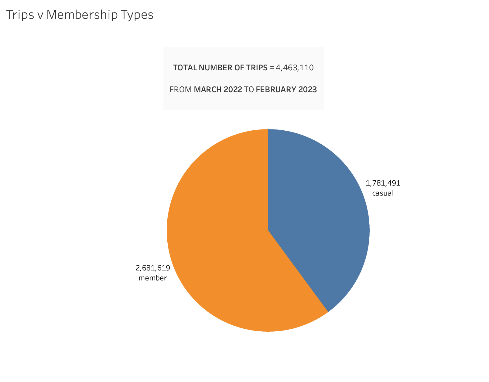
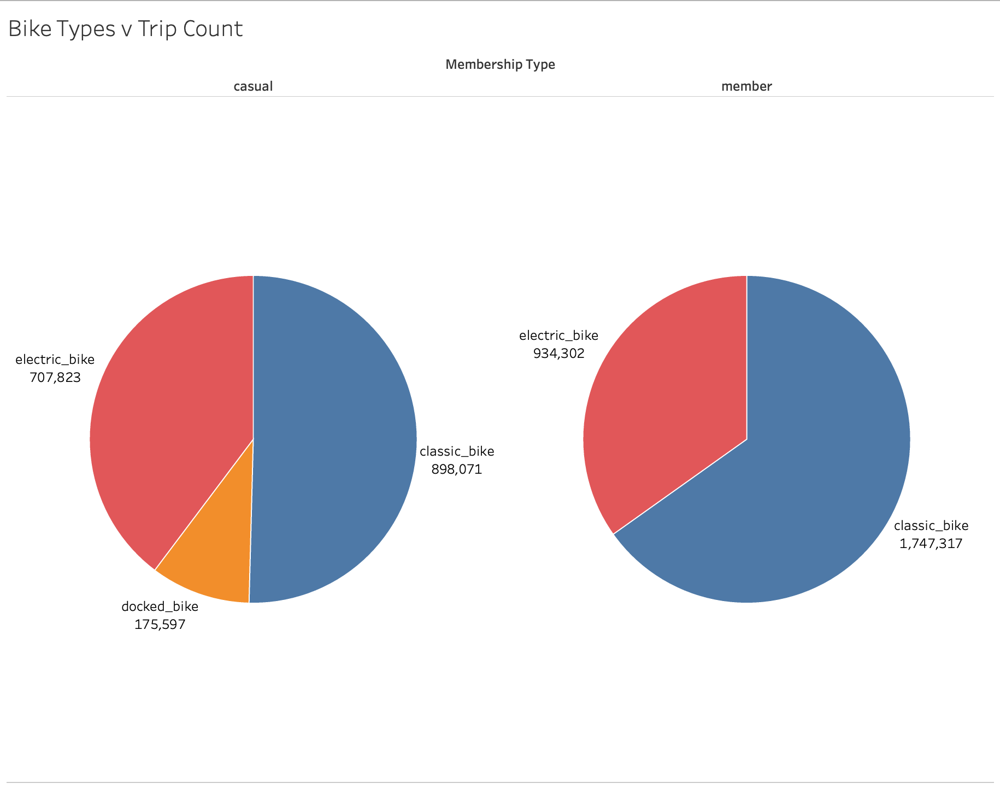
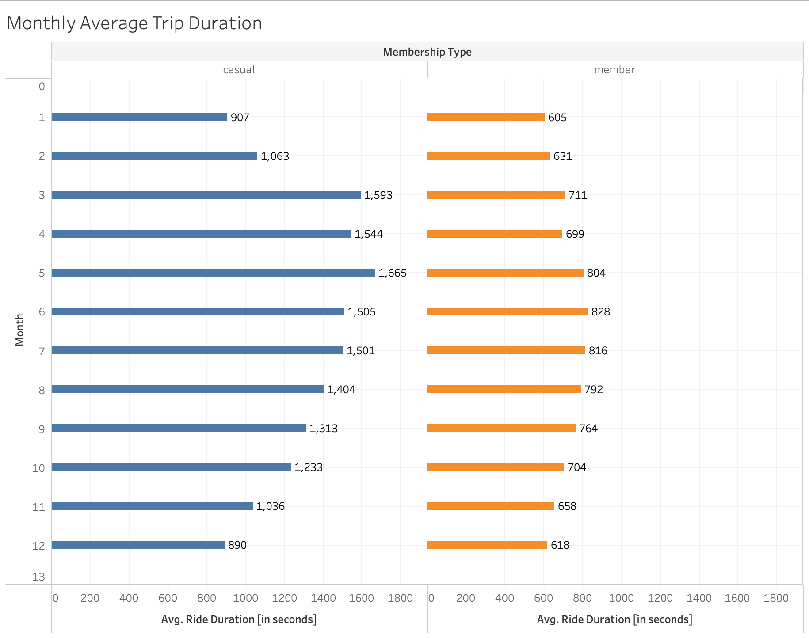
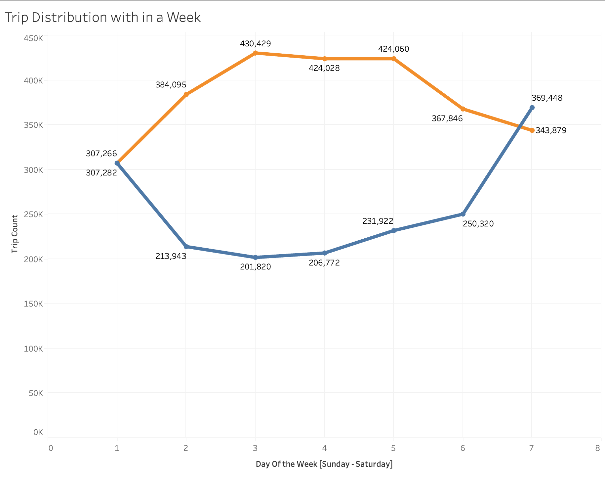
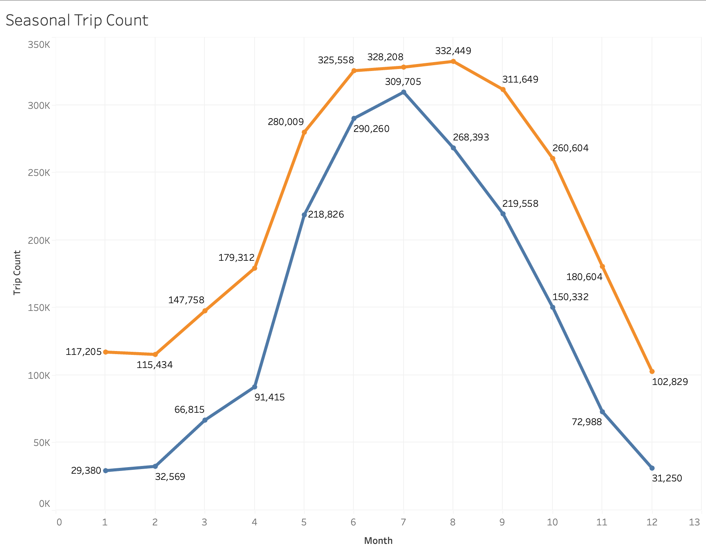
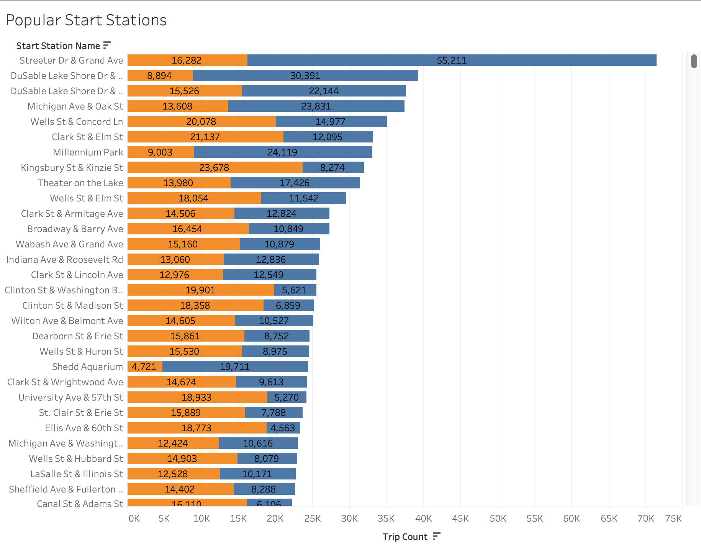
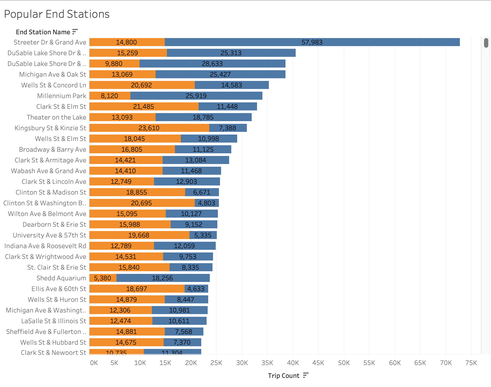

# Breaking the Cycle: Leveraging Data to Convert Casual Riders to Annual Members at Cyclistic

# Background

## Scenario

As a junior data analyst in the marketing analyst team at Cyclistic, a bike-share company based in Chicago, you have been tasked with the responsibility of studying the behavior of casual riders and annual members to help design a marketing strategy that will increase the number of annual memberships. The director of marketing strongly believes that the future success of the company depends on maximizing the number of annual memberships. 

Your team aims to gather insights into how the two groups use Cyclistic bikes differently, which will be used to design an effective marketing plan to convert casual riders into annual members. However, for your recommendations to be accepted by Cyclistic executives, they must be supported by compelling data insights and professional data visualizations.

## **About the company**

### I. Introduction

Cyclistic is a bike-sharing program launched in 2016. The program has grown to a fleet of 5,824 bicycles that are geotracked and locked into a network of 692 stations across Chicago.

### II. Market Segment

Cyclistic offers pricing plans that include single-ride passes, full-day passes, and annual memberships. Customers who purchase single-ride or full-day passes are referred to as casual riders. Customers who purchase annual memberships are Cyclistic members.

### III. Marketing Strategy

Cyclistic's marketing strategy has relied on building general awareness and appealing to broad consumer segments. One approach that helped make these things possible was the flexibility of its pricing plans.

### IV. Financial Analysis

Cyclistic's finance analysts have concluded that annual members are much more profitable than casual riders. Although the pricing flexibility helps Cyclistic attract more customers, maximizing the number of annual members will be key to future growth.

### V. Conversion Strategy

Cyclistic's marketing team is working to convert casual riders into annual members. The team needs to better understand how annual members and casual riders differ, why casual riders would buy a membership, and how digital media could affect their marketing tactics.

### VI. Market Research

Cyclistic is interested in analyzing the historical bike trip data to identify trends that can help them in designing marketing strategies aimed at converting casual riders into annual members.

# Objective

The objective of the case study is to analyze the differences in how annual members and casual riders use Cyclistic bikes. The upcoming six phases will serve as a guide in obtaining clear distinctions between our user types and their usages.

# ASK

## Business Task

*What is the problem you are trying to solve?*

To analyze the usage patterns of annual members and casual riders of Cyclistic bikes in order to identify differences and determine how to leverage these differences to convert more casual riders into annual members.

## Stakeholder

Primary: Lily Moreno (The director of marketing)

Secondary: The Executive team

# PREPARE

The data is located [here](https://divvy-tripdata.s3.amazonaws.com/index.html) where the users can download the Cyclistic trip data for each month since January 2020. But our scope of analysis only uses the last 12 months only(March 2022 - February 2023). The data has been made available by Motivate International Inc. under this [license](https://www.divvybikes.com/data-license-agreement).)

Our dataset consists 12 csv files for each month. Each file has been checked using R and the detail description of our data is as follows.

The provided dataset contains information about bike rides from a bike-sharing service. It has 12 columns with details about each ride, including the unique identifier for each ride, the type of bike used, the start and end times and locations, the latitude and longitude of the starting and ending stations, and whether the rider is a member or a casual rider.

## **Column Description**

`ride_id`: a unique identifier for each ride
`rideable_type`: the type of bike used for the ride (electric_bike or classic_bike)
`started_at`: the date and time the ride started
`ended_at`: the date and time the ride ended
`start_station_name`: the name of the station where the ride started
`start_station_id`: the identifier of the station where the ride started
`end_station_name`: the name of the station where the ride ended
`end_station_id`: the identifier of the station where the ride ended
`start_lat`: the latitude of the starting station
`start_lng`: the longitude of the starting station
`end_lat`: the latitude of the ending station
`end_lng`: the longitude of the ending station
`member_casual`: whether the rider is a member or a casual rider

The "member_casual" column specifies whether the rider is a member or a casual rider.

**Does it ROCCC?**

The data can become reliable once a proper cleanup is done because there are some missing values that can skew our analysis.

The data is provided by a 3rd party so its not original but its coming from a credible source(Motivate International Inc)

The data is comprehensive as it stated above it stores the necessary information of each trip. 

The data is continuously getting updated so up-to-date data is easily accessible.

The data is cited and is available under Data License Agreement. [License](https://ride.divvybikes.com/dataalicense-agreement)

# PROCESS

Documentation of Data Cleaning and Manipulation

### Data Cleaning

The data was too big for spreadsheets, so to make efficient cleaning & analysis I used R studio. 

**Steps**

1. Downloaded each file and stored it in a folder called bike_data
2. Open R Studio and create our analysis file
    1. install required packages & libraries 
        
```{r}
install.packages("tidyverse")
install.packages("skimr")
install.packages("janitor")
install.packages("anytime")
install.packages("chron")

library(tidyverse)
library(skimr)
library(janitor)
library(dplyr)
library(lubridate)
library(anytime)
library(chron)

```
     
3. Then imported each file into R using `read_csv()`
4. Removed rows with the following missing values: `started_at`, `ended_at`, `end_station_name`, `start_station_name`
5. Then I removed the columns `start_lat`, `start_lng`, `end_lat`, `end_lng`, `start_station_id`, `end_station_id` because they wouldn’t contribute much to our analysis. Since we can’t know the route the biker has taken using that data we can’t make any analysis regarding popular routes which makes those columns more or less useless in this context.

```{r}
file_names <- c("jan_23", "feb_23", "mar_22", "apr_22", "may_22", "jun_22", "jul_22", "aug_22", "sep_22", "oct_22", "nov_22", "dec_22")

clean_data <- data.frame()

for (file in file_names) {
  df <- readr::read_csv(paste0("BIKE_DATA/", file,".csv")) %>% 
    dplyr::filter(!is.na(started_at) & !is.na(ended_at) & !is.na(start_station_name) & !is.na(end_station_name)) %>% 
    dplyr::select(-c(start_station_id, end_station_id, start_lat, start_lng, end_lat, end_lng))
    
    clean_data <- rbind(clean_data,df)
}

```

Add 3 columns: first is ride duration, then day of week and a third one being the month 
```{r }
clean_data <- clean_data %>%
  dplyr::mutate(
    ride_duration = 
      if_else(ended_at >= started_at, difftime(ended_at, started_at), 
              as.difftime(0, units = "secs")),
    day_of_week = lubridate::wday(started_at, week_start = 7),
    month = lubridate::month(ended_at)
  )

```

Trips that lasted more than 24 hours don't make sense and those less than 20 seconds are meaningless. So both are removed. 

```{r}
rides_filtered <- subset(clean_data, 
                         (ride_duration >= as.difftime("00:00:20")) & 
                           (ride_duration <= as.difftime("23:59:59")))
```


Finally the dataset is exported for analysis 

```{r}
write_csv(rides_filtered,"cleaned_data.csv")
```

The cleaned data has 4,498,144 rows 10 columns    

# ANALYZE

### MEMBERSHIP V TRIP COUNT



### Observations

TOTAL NUMBER OF TRIPS = 4,463,110

FROM MARCH 2022 TO FEBRUARY 2023

MEMBERS = 2,681,619

CASUAL RIDERS =  1,781,491

It shows that our biggest users are the members 

## Bike Types v Trip Count



### **Observations**

Docked bikes are reserved for casual users only. 

And classic bikes are the popular by both users.

But in the winter electric bikes are preferred by casual users.

## Monthly Average Trip Length



### Observations

In terms of ride lengths casual users tend to have longer rides because they are paying per usage rather than by annual subscription.

The average ride length slightly increases May - Aug for members 

While the average ride length for casual users increases dramatically during Spring & Summer and declines sharply during winter

## Trip Counts v Day of the week



### Observations

Casual Users tend to use bikes predominantly during the weekends(Saturday & Sunday)

While Members usage tends to hit its peak during mid week (Tuesday, Wednesday & Thursday)

## Seasonal Bike Usage



### Observation

It shows bike usage by both users is significantly low during winter and reach its peak during summer

## Popular Stations





### Observations

The most popular stations for pickup & as a destination are the same 

1. Streeter Dr & Grand Avenue 
2. DuSable Lake Shore Dr & North Blvd
3. DuSable Lake Shore Dr & Monroe St
4. Michigan Av & Oak St
5. Wells St & Concord Ln

### Conclusions

- There are 3 types of bikes namely Electric, Classic & Docked bikes. But Docked bikes are only for casual users. Even then the usage for docked bikes is quite low compared to classic & Electric bikes. Classic bikes being the most popular by both users.
- Casual users mostly use our bikes on the weekends. That could mean they’re using them for recreational purposes mostly. While members use them during weekdays which means they use them for work as well.
- When we come to pickup & destinations “*Streeter Dr & Grand Avenue”* leads by a high margin specifically for casual users which implies they might live near that area.
- Both users’ bikes usage gets significantly affected by seasons. Consequently, in the winter their usage drops sharply due to the harsh weather while in the spring the usage starts to sharply increase reaching its peak in mid summer. Then usage starts to fall during autumn hitting a low during winter.

# SHARE

Complete Visuals with filters & multiple metrics are available on [Tableau Public](https://public.tableau.com/app/profile/eyob7851/viz/CaseStudy1GoogleDataAnalytics_16795105232160/Sheet7) 

# ACT

### Recommendations

- We should start running marketing campaign during summer season since that’s the peak of usage for casual users. Offering discounts to subscribe.
- During summer we can offer multiple types of annual subscription at a discount since users like to enjoy themselves with their peers or family. i.e. family packages, couples packages,
- Since the casual on the weekend are likely using it for recreational purposes we can gamify it and based on their achievements offer multi tiered discounts to subscription fee.
- There’s a high concentration of casual users in the above mentioned places so we can run location focused marketing campaigns as well.
